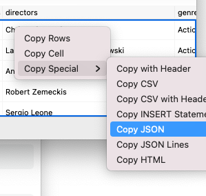

# 03 Exercise - SQL Aggregates

Calculate some values using SQL aggregate functions.

## Brief

Follow the [Getting Started](#getting-started) section to get a PostgreSQL database up and running locally. The database container comes with a movie dataset containing metadata about movie ratings, durations, and which streaming platforms you can find a movie on.

In this exercise, you will use your new SQL skills to query the movies dataset. You will save and submit your SQL queries and results.

## Getting Started

First, start up a Docker container with a new PostgreSQL database and movie dataset loaded. Run this command at your project's root directory:

```shell
docker run -d \
  --name sql-aggregates-db \
  -p 5432:5432 \
  -e POSTGRES_PASSWORD=password \
  -v sql-aggregates-db:/var/lib/postgresql/data \
  -v "$(pwd)/data:/docker-entrypoint-initdb.d" \
  -d \
  postgres
```
<details>
  <summary>Docker refresher</summary>

- `\` - This is the terminal syntax to ignore the new line and carry on reading commands from the next line.
- `--name` - A friendly name so we can reference the container later by name instead of an ID or randomly generated name.
- `-p 5432:5432` - this is the traditional port on which PostgreSQL runs. We are allowing this port on our local machine to access 5432 on the container.
- `-e POSTGRES_PASSWORD=password` - The password for your database's `postgres` user.
- `-v sql-aggregates-db:/var/lib/postgresql/data` - This creates a persistent volume named `sql-aggregates-db` and mounts the volume inside the container filesystem at `/var/lib/postgresql/data`. If you ever delete the container it is easy to spin up a new container without losing your data as the persistent volume can be re-used between containers.
- `-v "$(pwd)/data:/docker-entrypoint-initdb.d"` - After the entrypoint calls `initdb` to create the default postgres user and database, it will run any `*.sql` files found in the `$(pwd)/data` directory (the `pwd` command (print working directory) writes the full pathname of the current working directory to the standard output). (Scripts in `/docker-entrypoint-initdb.d` are only run if you start the container with a data directory that is empty; any pre-existing database will be left untouched on container startup.)
- `-d` - Run the container in detached mode (or in the background) as we don't need access to the terminal inside the container.
- `postgres` - The name of the user and the name container image to run. Note, there is no image tag specified, so Docker will use the latest image. Put `postgres` as the user and database if you are using Postico.

</details>

Second, make sure you can connect to the database with your SQL client. You should see a `public` schema and `movies` table. The table should have 16,000+ rows. You will be querying this movie dataset for the exercise.

Whatever SQL client you decide to use for this exercise, make sure it can save the query results in JSON format.

<details>
  <summary>If you are using Postico</summary>
  
  You can select all of the results with `cmd + a` and then 'copy' the JSON using the [Copy Special](https://github.com/jakob/Postico/issues/338) command.

  
</details>

<details>
  <summary>If you are using Azure Data Studio</summary>
  
  You can select all of the results with `cmd + a` and then save the results as JSON, from which you can then 'copy' the JSON.
  
  
</details>

### Submissions

This is a purely SQL query exercise. The only code you'll be writing is SQL queries.

In each of the `Part` folders will be a set of `.sql` files. Each `.sql` file has a `Task` in the SQL comment at the top of the file. You will need to write a query to complete the task. Make sure to save your SQL code in the `.sql` files.

Once you have your query results, save the result in JSON format in the corresponding `.json` file in the same folder as the `.sql` file.

```zsh
# for example in Part-A folder
1-count.sql    # your SQL query
1-count.json   # your SQL query results in JSON format
```

So, to summarize, for each `.sql` file you will need to submit the following:

- Your SQL query in the `.sql` file.
- The results of the query in a `.json` file.

### To run the tests

1. Open a Terminal in VS Code for this project.
2. Type `npm install` to install npm dependencies.
3. Type `npm test my-file-name.test.js` to run a single test file, or type `npm test` to run all the tests in the repo.

## Instructions Part A - Aggregate Queries

Work through all the SQL files in the [Part-A](./Part-A) folder.
